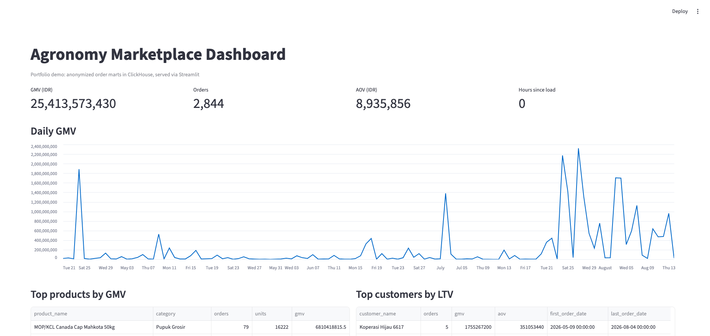

# Agronomy Marketplace Analytics

End-to-end portfolio project:

**Postgres (OLTP) -> stream -> ClickHouse (OLAP marts) -> dashboard**

Part of the [data portfolio monorepo](../../README.md).

## Domain

Anonymized marketplace order lines for agricultural inputs
(seeds, fertilizer, herbicides, tools). Buyer identities are hashed;
no phones, emails, or addresses.

## Architecture

```text
Postgres marketplace_orders     (source of truth)
        |
        |  watermark stream (updated_at, id)
        v
ClickHouse ecommerce.raw_orders
        |
        v
   SQL marts + quality checks
        |
   +----+----------------+
   |                     |
   v                     v
Metabase              Streamlit
(client BI)           (optional demo app)
```

## Dashboard: what to sell vs what to demo

Streamlit is fine for a **portfolio demo** and for a custom internal tool.
It is usually **not** what a client wants to buy as their daily BI.

| Tool | Who uses it | Sellable as |
|---|---|---|
| **Metabase** | Ops / finance / founders, click filters, save questions | Default for SME/startup freelance |
| Looker Studio | Google-shop teams | Cheap reporting |
| Power BI / Tableau | Corporate | Only if they already pay for it |
| Apache Superset | More technical teams | Open-source BI alternative |
| Streamlit | Analysts, custom apps, prototypes | MVP / internal app, not a BI platform |

This repo ships **Metabase** as the client-facing layer and keeps Streamlit as a 1-file demo.

## Quick start

```bash
cd projects/agronomy-marketplace-analytics
docker compose up -d --build
python -m venv .venv
source .venv/bin/activate
pip install -r requirements.txt
python scripts/run_pipeline.py
python checks/data_quality.py
```

Then:

- Metabase (sellable BI): http://localhost:3000
  - Add ClickHouse: host `clickhouse`, port `8123`, user `default`, password `analytics`, SSL off
    (this works because Metabase runs in the same Docker network)
- Streamlit demo: `streamlit run app/dashboard.py` then http://localhost:8501

### Prove the stream

```bash
python scripts/seed_more.py 5
# wait a few seconds
python checks/data_quality.py
```

Postgres gets new rows; the stream worker copies them into ClickHouse; marts rebuild.

### Dashboard preview



## What you get

- Postgres as operational source (`marketplace_orders`)
- Near-real-time sync into ClickHouse (`ReplacingMergeTree` + watermark)
- SQL marts: daily sales, customer LTV, top products
- Quality checks: PG vs CH parity, nulls, duplicates, freshness
- Metabase for stakeholders, Streamlit as optional demo

## Ports and credentials

| Service | Port | Login |
|---|---|---|
| Postgres | 5434 | agro / agro, db `marketplace` |
| ClickHouse | 8123 | default / analytics |
| Metabase | 3000 | first-run setup wizard |
| Streamlit | 8501 | local only |

## Layout

```text
agronomy-marketplace-analytics/
  docker-compose.yml
  app/dashboard.py
  checks/data_quality.py
  postgres/init/01_schema.sql
  scripts/run_pipeline.py
  scripts/stream_worker.py
  scripts/seed_more.py
  sql/
  sample_data/orders.csv
  docs/
```

## Metrics

| Metric | Definition |
|---|---|
| GMV | Sum of `quantity * unit_price` |
| Orders | Distinct `order_id` |
| AOV | GMV / Orders |
| Top products | Revenue by `product_name` |
| Freshness | Hours since latest ClickHouse sync |

## Case study / attachments

- [Case study](docs/case_study.md)
- Screenshot: `docs/screenshots/dashboard-metrics.png`
- Shared freelance pack: `../../docs/freelance_profile.md`
